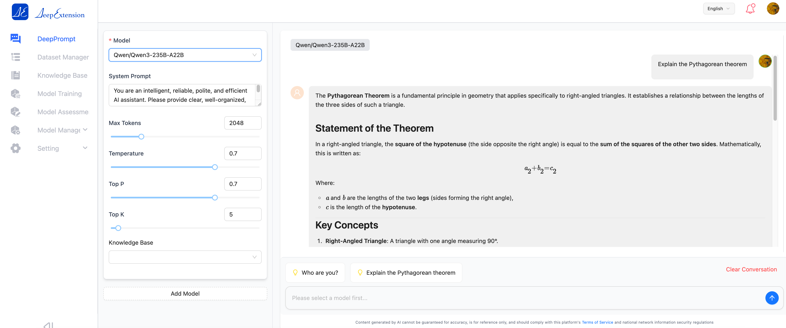

<div style="display: flex; align-items: center; justify-content: center;">
  
  <h1>DeepExtension</h1>
</div>

## 💡 1. What is DeepExtension?

[DeepExtension](https://deepextension.ai/) is an AI infrastructure platform built to help enterprises easily manage the entire lifecycle of large language model (LLM) development—from data preparation to fine-tuning, evaluation, and deployment.

Our mission is to make domain-specific AI development accessible, collaborative, and scalable, especially for teams with limited AI expertise or compute resources.

Whether you're an AI engineer or a business expert, DeepExtension offers a shared environment to build impactful models using modern techniques like PEFT, GRPO, and human-in-the-loop workflows—all through a modular, web-based interface.


## 📘 2. Official Documentation

📖 Visit: [https://docs.deepextension.ai/](https://docs.deepextension.ai/)

<div align="left" style="margin-top:20px;margin-bottom:20px;">

</div>

## 🎉 3. Follow the Project

⭐️ Star our [GitHub repository](https://github.com/DeepExtension-AI/DeepExtension) to stay updated and support the project!

## 🚀 4. Getting Started
You can install **DeepExtension** on:

- ✅ Linux or Windows via WSL (with CUDA for GPU training)
- ✅ macOS (with MLX on Apple M-series)
- ✅ Any Linux/macOS environment (in **no-training mode**) for UI exploration and inference only

### 📝 Prerequisites
- Docker Engine
> If you have not installed Docker on your local machine (Windows, Mac, or Linux), see [Install Docker Engine](https://docs.docker.com/engine/install/).

### 4.1 Clone the Repository

```bash
git clone https://github.com/DeepExtension-AI/DeepExtension.git
cd DeepExtension
```

### 4.2 Set Up Model Training Environment

DeepExtension offers different setup options based on your platform’s capabilities. Select the appropriate training configuration according to your operating environment.

<details>
<summary><strong> ✅ Linux/Windows with NVIDIA GPU</strong></summary>

##### Step 1: Verify GPU Passthrough Support

Run the following command in your terminal:

```bash
docker run -it --rm --gpus all pytorch/pytorch:latest \
    python -c "import torch; print(torch.cuda.is_available())"
```

- If the output is `True`, your GPU drivers and Docker setup are properly configured.
- If it returns `False`, check your CUDA, Docker, and NVIDIA driver installation.

##### Step 2: Prepare Training Image Variables

Open the environment configuration file:

```bash
DeepExtension/prod.env
```

Locate the following variables:

- `TRAINING_AI_IMAGE_NAME` (e.g., `local_deep_e_python_image`) → _denoted as_ `{ai_image_name}`
- `TRAINING_AI_IMAGE_VERSION` (e.g., `a1b2c3d4`) → _denoted as_ `{ai_image_version}`


##### Step 3: Build the Training Docker Image

Navigate to the training image directory and build the image:

```bash
cd DeepExtension/deep-e-python

docker build \
    -t {ai_image_name}:{ai_image_version} \
    -f Dockerfile . \
    --load
```

Replace `{ai_image_name}` and `{ai_image_version}` with the actual values from your `prod.env` obtaining from Step 2.
</details>

<details>
<summary><strong> ✅ macOS (Apple Silicon, M1–M4)</summary></strong>

##### Step 1:  Prepare the MLX Code
- Download the entire repository from [https://github.com/ml-explore/mlx-lm](https://github.com/ml-explore/mlx-lm) (tested successfully with v0.24.1)
- Copy the mlx_lm subdirectory from the mlx-lm project into training directory.
- Run the preparation script to apply required MLX code modifications for DeepExtension compatibility:
  ```bash
  cd DeepExtension/deep-e-python
  chmod +x prepare_mlx_changes.sh
  ./prepare_mlx_changes.sh
  ```
##### Step 2:  Set Up the Python Environment and Install Required Packages
- You can create new python environment and activate it either using **Conda**,
  ```bash
  conda create -n deepe_prod python=3.11
  conda activate deepe_prod
  ```
  or using **venv**,
  ```bash
  python3 -m venv deepe_prod
  source deepe_prod/bin/activate
  ```
- and then install required packages,
  ```bash
  pip3 install -r requirements_mac.txt
  ```
##### Step 3:  Install pm2
- Install Node.js and NPM
- Run:
  ```bash
  npm install -g pm2
  ```
</details>

<details>
<summary><strong> ✅ Any Linux/macOS Environment Without GPU (No-Training Mode)</summary></strong>
To run DeepExtension without training capabilities, open `DeepExtension/custom.conf` with any text editor and add the following line:
```
WITH_AI_IMAGE=false
```
</details>


### 4.4 Configure Optional Environment Settings (Optional)
By default, the Web UI uses port 88 and the AI Redis service uses port 6490. To customize the exposed ports, edit `DeepExtension/custom.conf`. For more information, refer to the [Installation Guide](https://deepextension.readthedocs.io/en/latest/developer/install/).


### 4.5 Start and Login
#### Start the Application
Run:
```bash
./run_compose.sh
```
Verify that:

- All images are downloaded
- All containers start successfully

#### First Login as Admin
During the first launch, a root user is created automatically.
The initial password is saved at: `DeepExtension/adminPassword/adminPassword.txt`

Use the following credentials to log in for the first time:
```
Project Code: 1001
Username: admin
Initial Password: (see file) -> DeepExtension/adminPassword/adminPassword.txt
```

### 4.7 Full Installation Guide

For advanced setups (e.g. MLX training, custom database), refer to the [Installation Guide](https://deepextension.readthedocs.io/en/latest/developer/install/).

## 🌟 5. Key Features

- 🤖 **Multi-Model Chat + Knowledge Base**  
  Interact with local or third-party models integrated with personal or corporate knowledge bases.

- 🔌 **Easy Integration with Third-Party Models**  
  Quickly plug in and switch between models like OpenAI, Anthropic, and more.

- 🚀 **Local Model Training & Deployment**  
  Train and fine-tune models locally, save results, and deploy with one click using Ollama or other tools.

- 📚 **Rapid Knowledge Base Creation**  
  Import documents (PDF, DOCX, XLSX, etc.) to build structured, searchable knowledge bases.

- 📊 **Model Evaluation & Comparison**  
  Benchmark different versions/models using built-in evaluation tools.

- 🗂 **Dataset Upload & Parsing**  
  Upload datasets and automatically parse them into structured formats to streamline training.


## 📚 6. Technical Overview

### 🏗️ Architecture Diagram

```
┌─────────────────────────────┐
          Web Frontend         
└─────────────┬───────────────┘
              │
┌─────────────▼───────────────┐
           Backend API         
└─────────────┬───────────────┘
              │
┌─────────────▼───────────────┐
     Task Orchestration Layer  
└─────────────┬───────────────┘
              │
┌─────────────▼───────────────┐
      Model Services Layer     
└─────────────┬───────────────┘
              │
┌─────────────▼───────────────┐
       Data & Knowledge Base   
└─────────────────────────────┘
```

### Module Breakdown

- **Frontend**: Web interface for end-to-end model management.
- **API Layer**: Connects UI with backend services and handles business logic.
- **Task Orchestration**: Manages workflows for training, evaluation, and inference.
- **Model Services**: Supports inference and fine-tuning for both local and third-party models.
- **Data Layer**: Manages structured data, vector databases, and document parsing.

### Advantages

- ✅ Decoupled, modular architecture  
- 📈 High availability and scalability  
- 🔐 Fine-grained permission control  
- 🌐 API-friendly for external integrations  

🔗 Learn more: [Architecture Documentation](https://docs.deepextension.ai/intro/architecture/)

- [Installation Guide](https://docs.deepextension.ai/developer/install/)
- [Frequently Asked Questions (FAQs)](https://docs.deepextension.ai/faq/)
- [Architecture Documentation](https://docs.deepextension.ai/intro/architecture/)

## 🏄 7. Open Source Community

- 🔧 Documentation: [https://docs.deepextension.ai/](https://docs.deepextension.ai/)
- 💬 Forum: Coming soon
- 🧑‍💻 GitHub: [https://github.com/DeepExtension-AI/DeepExtension](https://github.com/DeepExtension-AI/DeepExtension)


## 🙌 8. Technical Support

If you encounter any issues:

1. Refer to [Docs](https://docs.deepextension.ai/) or [FAQ](https://docs.deepextension.ai/faq/)
2. Email us: **support@deepextension.ai**

Please include:
- Platform version
- System info
- Screenshots or logs (if applicable)


## 🤝 9. Contact Us

- 📧 Email: contact@deepextension.ai  
- 🌐 Website: [https://www.deepextension.ai](https://www.deepextension.ai)  


## 👥 10. Feedback & Feature Requests

We welcome feedback and suggestions!

- Email: contact@deepextension.ai  
- GitHub Issues: [Submit here](https://github.com/DeepExtension-AI/DeepExtension/issues)


Thank you for supporting DeepExtension! 🚀
