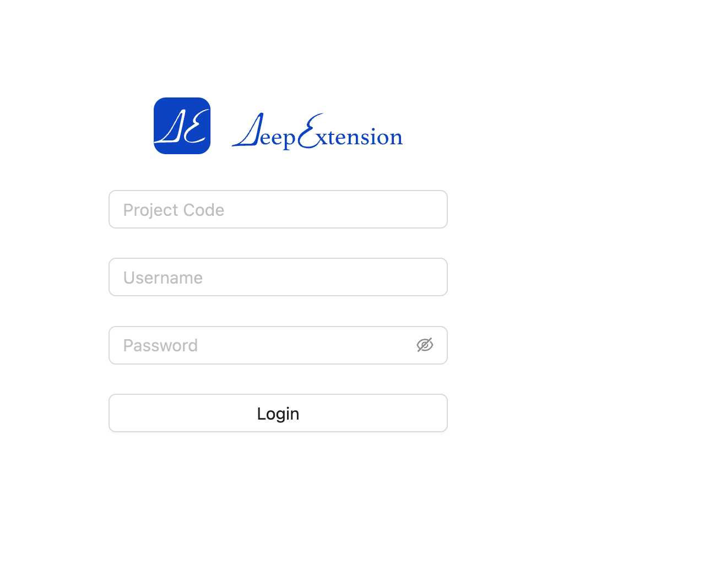

<div style="display: flex; align-items: center; justify-content: center;">
  
  <h1>DeepExtension</h1>
</div>

## 💡 1. What is DeepExtension?

[DeepExtension](https://deepextension.ai/) is an AI infrastructure platform built to help enterprises easily manage the entire lifecycle of large language model (LLM) development—from data preparation to fine-tuning, evaluation, and deployment.

Our mission is to make domain-specific AI development accessible, collaborative, and scalable, especially for teams with limited AI expertise or compute resources.

Whether you're an AI engineer or a business expert, DeepExtension offers a shared environment to build impactful models using modern techniques like PEFT, GRPO, and human-in-the-loop workflows—all through a modular, web-based interface.


## 📘 2. Official Documentation

📖 Visit: [https://docs.deepextension.ai/](https://docs.deepextension.ai/)

<div align="left" style="margin-top:20px;margin-bottom:20px;">

</div>

## 🎉 3. Follow the Project

⭐️ Star our [GitHub repository](https://github.com/DeepExtension-AI/DeepExtension) to stay updated and support the project!

## 🚀 4. Getting Started

You can install **DeepExtension** on the following platforms:

- ✅ **Linux** or **Windows (via WSL)** — with **CUDA** support for GPU training  
- ✅ **macOS (Apple M-series)** — with **MLX** backend  
- ✅ **Any Linux/macOS environment (no-training mode)** — for UI access and inference only

---

### 📝 Prerequisites

- **Docker Engine**  
  If Docker is not already installed, follow the official instructions:  
  👉 [Install Docker Engine](https://docs.docker.com/engine/install/)

---

### 4.1 Clone the Repository

```bash
git clone https://github.com/DeepExtension-AI/DeepExtension.git
cd DeepExtension
```

---

### 4.2 Start the Application

Run the startup script:

```bash
./run_compose.sh
```

Make sure that:

- All required Docker images are pulled
- All containers start without errors

---

#### 🎯 Access the Web UI

Once the services are up and running, open your browser and visit:  
[http://localhost:{webui_port}](http://localhost:{webui_port})

You can find `{webui_port}` in the `run_compose.sh` log output or through your Docker Engine container management interface.

**Example: Login Page**

<div align="left" style="margin-top:20px;margin-bottom:20px;">

</div>

---

#### 🔐 First-Time Admin Login

A **root admin user** is automatically created on first launch.

- **Initial password file:**

  ```
  DeepExtension/adminPassword/adminPassword.txt
  ```

- **Login credentials:**

  ```
  Project Code: 1001
  Username:     admin
  Password:     (see password file above)
  ```

---

#### 🔧 Available Features

**DeepExtension** currently supports:

- Managing third-party language models 
- Running inference and evaluation tasks on third-party models 
- Monitoring outputs and metrics via the Web UI

---

### 4.3 Set Up the Model Training Environment

To enable training, evaluation, saving, and deployment of **local models**, you'll need to configure the training environment.  
The setup process differs depending on your platform. Please refer to the full installation guide here:  
👉 [Set Up Model Training Environment](https://deepextension.readthedocs.io/en/latest/developer/install/#3-set-up-model-training-environment)

> **Note:**  
> You can still perform inference and evaluation with third-party models without configuring the training environment.

---

### 📚 4.4 Full Installation Guide

For advanced configuration options—such as MLX-based training or connecting to a custom database—refer to the full documentation:  
👉 [Installation Guide](https://deepextension.readthedocs.io/en/latest/developer/install/)

## 🌟 5. Key Features

- 🤖 **Multi-Model Chat + Knowledge Base**  
  Interact with local or third-party models integrated with personal or corporate knowledge bases.

- 🔌 **Easy Integration with Third-Party Models**  
  Quickly plug in and switch between models like OpenAI, Anthropic, and more.

- 🚀 **Local Model Training & Deployment**  
  Train and fine-tune models locally, save results, and deploy with one click using Ollama or other tools.

- 📚 **Rapid Knowledge Base Creation**  
  Import documents (PDF, DOCX, XLSX, etc.) to build structured, searchable knowledge bases.

- 📊 **Model Evaluation & Comparison**  
  Benchmark different versions/models using built-in evaluation tools.

- 🗂 **Dataset Upload & Parsing**  
  Upload datasets and automatically parse them into structured formats to streamline training.


## 📚 6. Technical Overview

### 🏗️ Architecture Diagram

```
┌─────────────────────────────┐
          Web Frontend         
└─────────────┬───────────────┘
              │
┌─────────────▼───────────────┐
           Backend API         
└─────────────┬───────────────┘
              │
┌─────────────▼───────────────┐
     Task Orchestration Layer  
└─────────────┬───────────────┘
              │
┌─────────────▼───────────────┐
      Model Services Layer     
└─────────────┬───────────────┘
              │
┌─────────────▼───────────────┐
       Data & Knowledge Base   
└─────────────────────────────┘
```

### Module Breakdown

- **Frontend**: Web interface for end-to-end model management.
- **API Layer**: Connects UI with backend services and handles business logic.
- **Task Orchestration**: Manages workflows for training, evaluation, and inference.
- **Model Services**: Supports inference and fine-tuning for both local and third-party models.
- **Data Layer**: Manages structured data, vector databases, and document parsing.

### Advantages

- ✅ Decoupled, modular architecture  
- 📈 High availability and scalability  
- 🔐 Fine-grained permission control  
- 🌐 API-friendly for external integrations  

🔗 Learn more: [Architecture Documentation](https://docs.deepextension.ai/intro/architecture/)

- [Installation Guide](https://docs.deepextension.ai/developer/install/)
- [Frequently Asked Questions (FAQs)](https://docs.deepextension.ai/faq/)
- [Architecture Documentation](https://docs.deepextension.ai/intro/architecture/)

## 🏄 7. Open Source Community

- 🔧 Documentation: [https://docs.deepextension.ai/](https://docs.deepextension.ai/)
- 💬 Forum: Coming soon
- 🧑‍💻 GitHub: [https://github.com/DeepExtension-AI/DeepExtension](https://github.com/DeepExtension-AI/DeepExtension)


## 🙌 8. Technical Support

If you encounter any issues:

1. Refer to [Docs](https://docs.deepextension.ai/) or [FAQ](https://docs.deepextension.ai/faq/)
2. Email us: **support@deepextension.ai**

Please include:
- Platform version
- System info
- Screenshots or logs (if applicable)


## 🤝 9. Contact Us

- 📧 Email: contact@deepextension.ai  
- 🌐 Website: [https://www.deepextension.ai](https://www.deepextension.ai)  


## 👥 10. Feedback & Feature Requests

We welcome feedback and suggestions!

- Email: contact@deepextension.ai  
- GitHub Issues: [Submit here](https://github.com/DeepExtension-AI/DeepExtension/issues)


Thank you for supporting **DeepExtension**! 🚀
