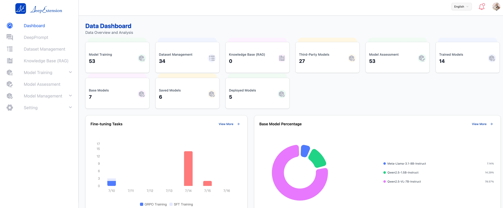
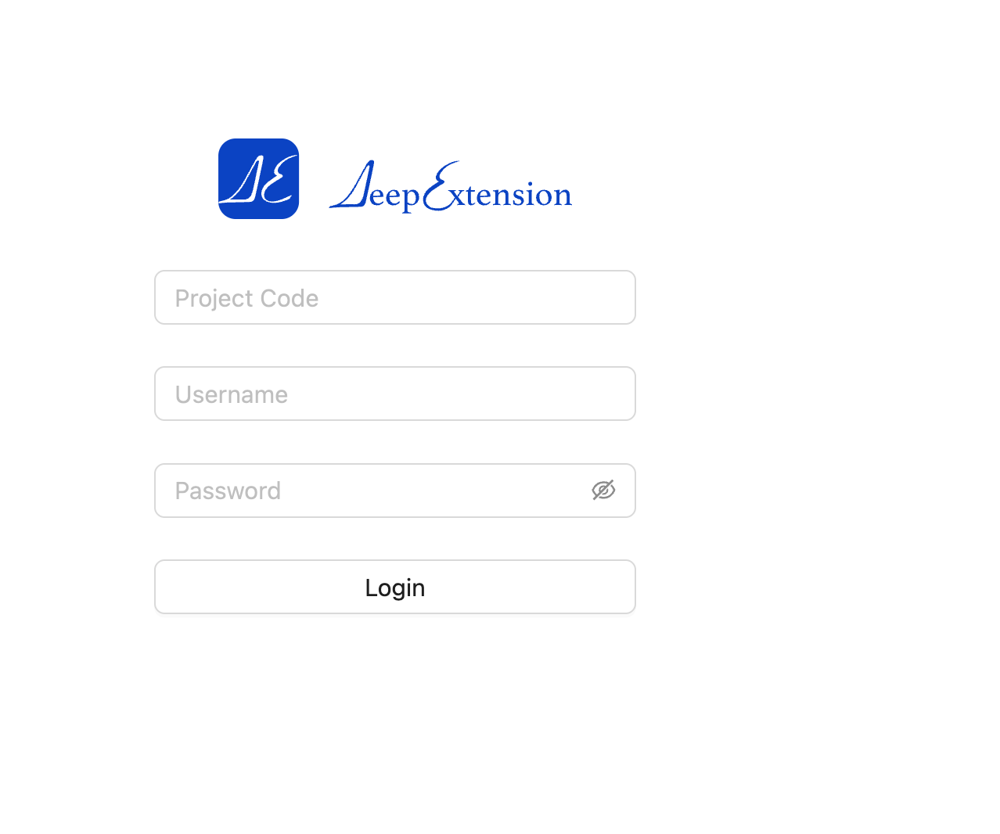

<div style="display: flex; align-items: center; justify-content: center;">
  
  <h1>DeepExtension</h1>
</div>

## 💡 1. Was ist DeepExtension?

[DeepExtension](https://deepextension.ai/de/de_home/) ist eine KI-Infrastrukturplattform, die Unternehmen dabei unterstützt, den gesamten Lebenszyklus der Entwicklung großer Sprachmodelle (LLM) einfach zu verwalten – von der Datenvorbereitung über das Finetuning und die Evaluierung bis hin zur Bereitstellung.

Unsere Mission ist es, die domänenspezifische KI-Entwicklung **benutzerfreundlich, kollaborativ und skalierbar** zu machen – besonders für Teams ohne KI-Expertise oder mit begrenzten Rechenressourcen.

Egal ob Sie KI-Ingenieur oder Fachexperte sind, DeepExtension bietet Ihnen eine kollaborative Umgebung, in der Sie mit modernen Technologien wie **PEFT** und **GRPO** hochwertige Modelle erstellen können – alles über eine modulare Weboberfläche.

## 📘 2. Offizielle Dokumentation

Bitte besuchen Sie [https://docs.deepextension.ai/de/](https://docs.deepextension.ai/de/) für die offizielle Dokumentation.
<div align="left" style="margin-top:20px;margin-bottom:20px;">

</div>

## 🎉 3. Projekt folgen

⭐️ Klicken Sie oben rechts auf Star, um DeepExtension zu folgen und Benachrichtigungen über neue Releases zu erhalten! 🌟


## 🚀 4. Erste Schritte

Sie können **DeepExtension** auf den folgenden Plattformen installieren:

- ✅ **Linux** oder **Windows (über WSL)** — mit **CUDA**-Unterstützung für GPU-Training  
- ✅ **macOS (Apple M-Serie)** — mit **MLX**-Backend  
- ✅ **Jede Linux/macOS-Umgebung (ohne Trainingsmodus)** — nur für UI-Zugriff und Inferenz

---

### 📝 Voraussetzungen

- **Docker Engine**  
  Wenn Docker noch nicht installiert ist, folgen Sie der offiziellen Anleitung:  
  👉 [Docker Engine installieren](https://docs.docker.com/engine/install/)

---

### 4.1 Repository klonen

```bash
git clone https://github.com/DeepExtension-AI/DeepExtension.git
cd DeepExtension
```

---

### 4.2 Anwendung starten

Führen Sie das Startskript aus:

```bash
./run_compose.sh
```

Stellen Sie sicher, dass:

- Alle erforderlichen Docker-Images heruntergeladen wurden
- Alle Container fehlerfrei gestartet wurden

---

#### 🎯 Zugriff auf das Web-UI

Sobald die Dienste laufen, öffnen Sie Ihren Browser und gehen Sie zu:  
[http://localhost:{webui_port}](http://localhost:{webui_port})

Standardmäßig verwendet die Weboberfläche den Port 88.
Wenn Port 88 bereits belegt ist, verwendet die Anwendung automatisch einen verfügbaren Port.
Sie finden `{webui_port}` im Log-Ausgabe von `run_compose.sh` oder über Ihre Docker Engine-Verwaltungsschnittstelle.

**Beispiel: Login-Seite**

<div align="left" style="margin-top:20px;margin-bottom:20px;">

</div>

---

#### 🔐 Erstmaliger Admin-Login

Ein **Root-Admin-Benutzer** wird beim ersten Start automatisch erstellt.

- **Datei mit dem Anfangspasswort:**

  ```
  DeepExtension/adminPassword/adminPassword.txt
  ```

- **Anmeldedaten:**

  ```
  Projektcode: 1001
  Benutzername: admin
  Passwort:     (siehe obige Passwortdatei)
  ```

---

#### 🔧 Verfügbare Funktionen

**DeepExtension** unterstützt derzeit:

- Verwaltung von Drittanbieter-Modellen
- Durchführung von Inferenz- und Evaluierungsaufgaben mit Drittanbieter-Modellen
- Überwachung von Ausgaben und Metriken über das Web-UI

---

### 4.3 Trainingsumgebung für Modelle einrichten

Um das Training, die Evaluierung, das Speichern und die Bereitstellung **lokaler Modelle** zu ermöglichen, müssen Sie die Trainingsumgebung konfigurieren.  
Der Einrichtungsprozess unterscheidet sich je nach Plattform. Siehe vollständige Installationsanleitung:  
👉 [Trainingsumgebung einrichten](https://deepextension.readthedocs.io/en/latest/de/developer/install/#3-set-up-model-training-environment)

> **Hinweis:**  
> Auch ohne konfigurierte Trainingsumgebung können Sie Inferenz- und Evaluierungsaufgaben mit Drittanbieter-Modellen durchführen.

---

### 📚 4.4 Vollständige Installationsanleitung

Für erweiterte Konfigurationsoptionen — wie MLX-basiertes Training oder Anbindung an eine benutzerdefinierte Datenbank — lesen Sie die vollständige Dokumentation:  
👉 [Installationsanleitung](https://deepextension.readthedocs.io/en/latest/de/developer/install/)

## 🌟 5. Hauptfunktionen

- 🤖 **Mehrmodell-Dialog und Wissensdatenbank-Referenz**: Unterstützt den Dialog mit lokal trainierten Modellen und verschiedenen Drittanbieter-Modellen (z.B. gängige KI-Plattformen) sowie die Integration von persönlichen oder unternehmensweiten Wissensdatenbanken für intelligente Q&A und Wissensabruf.
- 🔌 **Einfache Integration von Drittanbieter-Modellen und -Plattformen**: Schnelles Hinzufügen und Wechseln zwischen verschiedenen Modellen und Plattformen, geeignet für vielfältige Anwendungsszenarien.
- 🚀 **Lokales Modelltraining und One-Click-Bereitstellung**: Unterstützt das Training und Finetuning von Modellen in lokalen Umgebungen, speichert Trainingsergebnisse schnell und ermöglicht eine effiziente Bereitstellung, z.B. in Ollama-Umgebungen, um die Modelliteration zu beschleunigen.
- 📚 **Schneller Aufbau persönlicher Wissensdatenbanken**: Einfache Erstellung persönlicher Wissensdatenbanken, flexibler Import verschiedener Dateiformate (z.B. PDF, DOCX, XLSX) für effizientes Wissensmanagement und -erweiterung.
- 📊 **Modellevaluierung und Vergleichsanalyse**: Integrierte Bewertungstools ermöglichen den Vergleich von Modellen mit unterschiedlichen Leistungen und Versionen, um das am besten geeignete Zielmodell auszuwählen.
- 🗃️ **Datensatz-Upload und -Analyse**: Unterstützt das Hochladen und automatische Parsen von Datensätzen für das Modelltraining, vereinfacht die Datenvorbereitung und beschleunigt die Entwicklung.
- 📥 **Unterstützung für Bild- und Bild-Text-Multimodalmodelle**：Unterstützung für Online-Inferenz, lokales Finetuning und automatische Bewertung von Bild- und Bild-Text-Multimodalmodellen hinzugefügt. Einsetzbar für verschiedene visuelle Aufgaben wie visuelle Fragebeantwortung und Vergleichsanalyse, was eine schnelle Iteration und Umsetzung ermöglicht.

## 📚 6. Technische Dokumentation

DeepExtension verwendet eine modulare, mehrschichtige Systemarchitektur, die hohe Verfügbarkeit, Skalierbarkeit und Wartungsfreundlichkeit gewährleistet. Das Architekturdesign ist wie folgt:

### 🏗️ Systemarchitektur-Übersicht

```
┌────────────────────────────────────────────────────┐
                    Web-Frontend         
└────────────────────────┬───────────────────────────┘
                         │
┌────────────────────────▼───────────────────────────┐
                 Backend-Service (API)     
└────────────────────────┬───────────────────────────┘
                         │
┌────────────────────────▼───────────────────────────┐
    Aufgaben-Orchestrierung & Management (TaskFlow)  
└────────────────────────┬───────────────────────────┘
                         │
┌────────────────────────▼───────────────────────────┐
     Modellservice (Inference/Training/Evaluierung)    
└────────────────────────┬───────────────────────────┘
                         │
┌────────────────────────▼───────────────────────────┐
          Daten & Wissensdatenbank (Data/KB)      
└────────────────────────────────────────────────────┘
```

### Hauptmodul-Beschreibungen

- **Web-Frontend**: Bietet eine intuitive Benutzeroberfläche für Modellmanagement, Wissensdatenbankverwaltung, Aufgabenorchestrierung, Datensatz-Upload und mehr.
- **Backend-Service (API)**: Verantwortlich für Geschäftslogik, Rechteprüfung, Aufgabenplanung usw. und verbindet das Frontend mit den Backend-Diensten.
- **Aufgaben-Orchestrierung & Management (TaskFlow)**: Automatisiert das Orchestrieren und Verwalten von Aufgaben wie Modelltraining, Evaluierung und Inferenz, unterstützt parallele Aufgaben und Statusverfolgung.
- **Modellservice**: Unterstützt Inferenz, Training und Evaluierung von lokalen und Drittanbieter-Modellen mit flexiblem Registrierungs- und Aufrufmechanismus.
- **Daten & Wissensdatenbank**: Zentrale Verwaltung von strukturierten und unstrukturierten Daten, unterstützt den Import verschiedener Dateiformate, Wissensextraktion und -abruf.

### Architekturvorteile

- **Modulare Entkopplung, flexible Erweiterung**: Jedes Modul kann unabhängig bereitgestellt werden, was die Erweiterung und Wartung erleichtert.
- **Hohe Verfügbarkeit und Skalierbarkeit**: Unterstützt verteilte Bereitstellung und Lastverteilung für unterschiedliche Anforderungen.
- **Sicher und konform**: Feingranulare Rechtekontrolle und Datenisolierung gewährleisten Datensicherheit.
- **Offene Integration**: Umfangreiche API-Unterstützung für die Anbindung an externe Drittanbieter-Modellplattformen.

> Eine detaillierte Architekturübersicht finden Sie in der [offiziellen Architekturdokumentation](https://docs.deepextension.ai/de/intro/architecture/).

- [Installationsanleitung](https://docs.deepextension.ai/de/developer/install/)
- [Häufige Fragen (FAQs)](https://docs.deepextension.ai/de/faq/)
- [Architekturdokumentation](https://docs.deepextension.ai/de/intro/architecture/)
## 🏄 7. Open-Source-Community
- Dokumentationszentrum: Besuchen Sie das offizielle DeepExtension-Dokumentationsportal, [https://deepextension.readthedocs.io/en/latest/de/](https://docs.deepextension.ai/de/)
- Community-Forum: Nehmen Sie an Diskussionen teil, geben Sie Feedback oder schlagen Sie Funktionen vor (demnächst verfügbar)
- GitHub: Verfolgen Sie Releases, melden Sie Probleme oder beteiligen Sie sich an unseren Open-Source-Komponenten, [https://github.com/DeepExtension-AI/DeepExtension](https://github.com/DeepExtension-AI/DeepExtension)
## 🙌 8. Technischer Support
Wenn Sie bei der Nutzung von DeepExtension auf Probleme stoßen:

1. Bitte konsultieren Sie zunächst die relevanten Dokumente und FAQs;
2. Wenn das Problem weiterhin besteht, kontaktieren Sie uns bitte per E-Mail an support@deepextension.ai und geben Sie folgende Informationen an:
- DeepExtension Versionsnummer
- Verwendetes Betriebssystem / Umgebung
- Detaillierte Fehlermeldung oder Screenshot (falls zutreffend)
Wir antworten innerhalb von zwei Werktagen.
## 🤝 9. Kontakt
Für allgemeine Anfragen, Kooperationen oder Medienanfragen kontaktieren Sie uns bitte wie folgt:

- E-Mail: contact@deepextension.ai
- Offizielle Website: https://deepextension.ai/de/de_home/

## 👥 10. Feedback und Funktionsvorschläge
Ihr Feedback ist uns sehr wichtig! Teilen Sie uns gerne mit, welche Funktionen Sie hilfreich finden, welche Probleme bestehen und welche Features Sie sich für die Zukunft wünschen.
Feedback-Kanäle:

- E-Mail: contact@deepextension.ai
- GitHub Issues (für technische Vorschläge) 


Vielen Dank für Ihre Unterstützung von DeepExtension! 🚀
